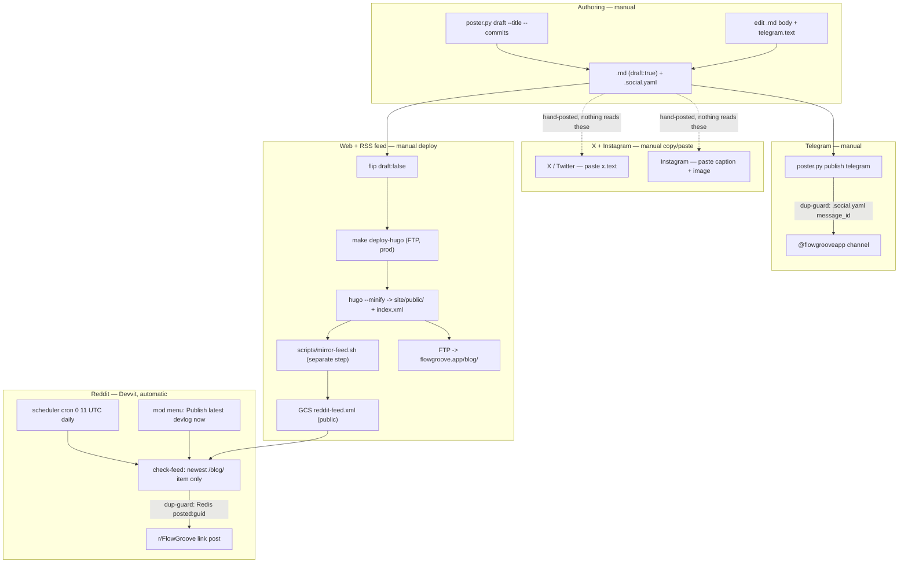

# FlowGroove Architecture

**Last Updated:** June 16, 2026  
**Version:** 0.14.0+203

## Overview

This repository contains five meaningful systems:

1. Flutter application
2. Hugo marketing site
3. Telegram bot (lives inside Firebase Functions)
4. Firebase Functions workspace
5. Imported AI workspace context (`memory/`, `.codex/`)

The operational product is split across the Flutter app and the Hugo site. The other areas support deployment, support operations, and continuity.

## Top-Level Layout

```text
flutter_repsync_app/
├── lib/                # Flutter app source
├── test/               # Flutter tests
├── site/               # Hugo source
├── docs/               # GitHub Pages output + reports
├── functions/          # Firebase Functions (incl. Telegram bot in src/telegram/)
├── scripts/            # build, deploy, session, and maintenance scripts
├── memory/             # protected project memory bank
├── .codex/             # active Codex control plane and imported workspace context
└── oldarchive/         # archived Qwen context, exports, backups, and legacy support files
```

## Runtime Systems

### 1. Flutter App

Primary app code lives in `lib/`.

#### Main Layers

- `screens/` - route-level UI
- `widgets/` - reusable UI components
- `providers/` - Riverpod state and derived permissions
- `repositories/` - data access boundaries
- `services/` - integration and business logic
- `models/` - domain and transfer objects
- `router/` - GoRouter configuration
- `theme/` - MonoPulse theme system
- `config/` - runtime/web/mobile config helpers

#### Key Flows

- Auth: Firebase Auth -> `auth_provider.dart` -> GoRouter redirects
- Data: Firestore repositories + local cache + sync orchestration
- Tools: Metronome and tuner providers drive tool-specific widgets
- Permissions: app-level role checks in `permissions_provider.dart`

#### Current User-Facing Modules

- Home/dashboard
- Auth screens
- Songs
- Bands
- Setlists
- Profile
- Metronome
- Tuner

### 2. Hugo Site

Marketing-site source lives in `site/`.

#### Purpose

- landing page
- FAQ, about, privacy, terms
- blog and SEO content
- public roadmap (`/roadmap/`) — build-time snapshot of GitHub Project #8
- GitHub Pages preview root
- production root site for FTP deployment

The roadmap page renders the project board on-site (GitHub blocks iframing). On
each deploy, `scripts/fetch-roadmap.sh` pulls Project #8 via `gh api graphql`
into `site/data/roadmap.json`, and `layouts/_default/roadmap.html` renders it as
kanban columns from the `Status` field. Needs `gh` authed with the `project`
scope; on failure it keeps the existing snapshot so deploys never break. Note:
the home page nav is hardcoded in `layouts/index.html` (not the PaperMod menu),
so nav links must be added in both `hugo.toml` and `layouts/index.html`.

#### Important Output Paths

- GitHub Pages preview root: `docs/`
- production FTP root: `site/public/` mirrored to `flowgroove.app/`

### 3. Telegram Bot

There is a single bot — **@flowgroovebot** — served by the `telegramWebhook`
Cloud Function in `functions/src/telegram/` (Telegraf/Node). The same bot also
posts devlogs to the `@flowgrooveapp` channel via `poster/poster.py` (same token).

#### Purpose

- link Telegram users to FlowGroove accounts
- route support DMs into the `SUPPORT_GROUP_ID` group as per-user forum topics, with admin replies routed back to the user
- post devlogs to the announce channel (poster script)

This subsystem is documented separately in `functions/src/telegram/README.md`.

### Devlog publishing pipeline

One devlog post fans out from a single source. Only **Reddit** is automated — a
Devvit *cloud* cron crossposts the newest feed item to `r/FlowGroove` (live there
since 2026-06-29; before that the bot was installed only in the test sub). The Hugo
site and the Telegram channel are posted **manually** — the old nightly launchd
auto-deploy (`devlog-daily.sh`) was unreliable (macOS Full Disk Access, exit 126)
and is disabled. X and Instagram are manual too: copy is pre-written in the post's
`.social.yaml` sidecar (`x` / `instagram` blocks) — nothing reads those. The map
below shows every entry point and the two dedup guards.



**Entry points**

| Channel | Trigger | Type | Source |
|---------|---------|------|--------|
| Web | `make deploy-hugo` (FTP → flowgroove.app) | manual | `Makefile` |
| Reddit feed | `scripts/mirror-feed.sh` — run **after** deploy | manual | `scripts/mirror-feed.sh` |
| Telegram | `poster.py publish telegram <slug>` (needs a `.social.yaml`) | manual | `poster/poster.py` |
| Reddit | scheduler cron `0 11 * * *` (live in r/FlowGroove since 2026-06-29) | scheduled (cloud) | `reddit-bot/devvit.json` |
| Reddit | mod menu "Publish latest devlog now" | manual (mod) | `reddit-bot/src/server/index.ts` |
| X / Twitter | copy `x.text` from the sidecar, post by hand | manual | `<post>.social.yaml` |
| Instagram | copy `instagram.caption` + `image`, post by hand | manual | `<post>.social.yaml` |

The nightly `devlog-daily.sh` launchd job (09:00) that used to chain deploy + feed
mirror is **disabled** — it failed under macOS Full Disk Access (exit 126). Deploys
are manual; re-enable only after granting FDA to the launchd process.

**Caveats:**
- `make deploy-hugo` uploads the site over FTP but does **not** refresh the Reddit
  feed — run `scripts/mirror-feed.sh` after it (the disabled nightly job used to chain
  the two; `scripts/deploy-hugo.sh` is the GitHub-Pages/dev path and mirrors on its own).
- The Reddit bot posts only the **newest** `/blog/` item per feed refresh. Deploy one
  post at a time when each needs to reach Reddit (see `poster/README.md`, `reddit-bot/README.md`).
- **Telegram needs the `.social.yaml` sidecar** (`telegram.text`); web + Reddit don't.
  The 2026-06-25 series posts ship without sidecars, so they reach web + Reddit but
  **not** Telegram until a sidecar is added.
- **X / Instagram:** no automation — the sidecar just stores the copy. X links are
  clickable; Instagram captions are not, so the `instagram` block says "link in bio"
  and carries a hashtag block + an `image` pointer (no per-post images exist; reuse a
  shared asset from `site/static/images/`).

### 4. Firebase Functions

Cloud function code lives in `functions/` (Node 22, gen-2). Implementations are under
`functions/src/`; `functions/index.js` only wires exports. Mocha tests run against the
Firestore emulator (`npm test` — needs JDK 21+).

Server-authoritative callables (admin-SDK, so they bypass client-side rules):

- `joinBand`, `updateBandMember` (`src/bands.js`) — atomic membership writes.
- `deleteAccount` (`src/account.js`) — account deletion for Google Play: detaches the
  user from every band (dissolving empty ones, promoting a remaining member if needed),
  recursive-deletes their data + avatar, then deletes the Auth user last. No client
  re-auth needed.
- `ensureCanonicalSong` (`src/canonical.js`) — dedupe/create canonical songs.
- `setBandAvatar` / `removeBandAvatar` (`src/band_avatar.js`),
  `importTelegramAvatar` / `importGoogleAvatar` (`src/avatars.js`).
- `createApiKey` / `listApiKeys` / `revokeApiKey` (`src/mcp/keys.js`) — per-user MCP
  API keys (random token shown once, only its SHA-256 stored, revocable, demo-blocked).

HTTP + scheduled: `telegramWebhook`, `shareToTelegram`, `onBandSetlistCreated`,
`dailyEventReminder` (`src/telegram/`), plus the MCP endpoints `mcpGateway`
(`src/mcp/gateway.js`, API-key) and `mcpRemote` (`src/mcp/remote.js`, remote OAuth) — see §6.

### 5. AI Workspace Context

The repo keeps a protected memory bank and a normalized Codex control plane:

- `memory/` - protected root memory bank
- `.codex/` - preferred active structure for agents, rules, tasks, sessions, and durable workflow state
- `oldarchive/` - archived Qwen source context and related historical outputs

This context is operational documentation, not app runtime code.

### 6. AI-ready Song Workflow / MCP

The **Song JSON** format (`docs/SONG_JSON_SCHEMA.md`, `services/json/song_json_codec.dart`)
is the stable contract for letting a user's own AI prepare songs. Three ways to use it, all
sharing one set of tool functions (`src/mcp/tools.js`):

- **Manual (built):** export a song as JSON / paste AI output into Import (auto-detects
  JSON vs CSV, validated + previewed before save). Ready-made prompts via
  `services/json/song_ai_prompt.dart` + `docs/AI_PROMPTS.md`.
- **MCP API key (built + deployed, e2e-verified):** per-user **API key** (in-app: Profile →
  *AI access (MCP)*; token shown once, only its SHA-256 stored) → the authenticated
  `mcpGateway` (maps key→uid, read/write scope) → a user-run **Node MCP server** (`mcp/`,
  `@modelcontextprotocol/sdk`). Live in prod. See `mcp/README.md`.
- **Remote OAuth connector (spike; provider/deploy gated):** `mcpRemote`
  (`src/mcp/remote.js`) — a hosted MCP Streamable-HTTP server so Claude/ChatGPT add
  FlowGroove as a **one-click custom connector** (OAuth 2.1 via a managed provider + Google
  login → Firebase uid). No key, no local server. Runbook: `docs/MCP_REMOTE_SETUP.md`.

Every path validates writes server-side (`src/mcp/song_schema.js`), scopes them to the
caller's own uid, and does no canonical-song or destructive writes. Users bring their own AI,
so FlowGroove pays no tokens. Richer tools (sections/chords/lab/homework) land with Song Lab.

## App Structure

### Routing

`lib/router/app_router.dart` defines:

- public auth routes:
  `login`, `register`, `forgot-password`
- shell-based app routes under `/main/...`
- branches for:
  `home`, `songs`, `bands`, `setlists`, `profile`, `metronome`, `tuner`

### State Management

The app uses Riverpod 3.x.

Key provider groups:

- `providers/auth/` - auth and error state
- `providers/data/` - repositories, metronome, song BPM
- `providers/sync/` - reconnect and write queue orchestration
- feature providers:
  `tuner_provider.dart`
  `song_autocomplete_provider.dart`
  `permissions_provider.dart`
  `wakelock_provider.dart`

### Data And Services

Primary service areas:

- Firebase/Firestore access
- audio engine and pitch detection
- CSV/PDF export (incl. per-song chords+lyrics performance sheet PDF)
- ChordPro lyrics+chords: parse/transpose (`utils/chordpro.dart`), render
  (`widgets/chord_chart_view.dart`), and paste-to-import
- Song JSON import/export — versioned, documented format
  (`services/json/song_json_codec.dart`, schema in `docs/SONG_JSON_SCHEMA.md`); the
  import dialog auto-detects JSON vs CSV. This is the contract the AI/MCP layer writes against.
- connectivity and cache control
- matching/search utilities
- external API wrappers for Spotify and MusicBrainz

### Tool Architecture

#### Metronome

- provider-driven state
- custom time signatures and accent patterns
- transport and fine adjustment widgets
- audio engine prewarm on startup

#### Tuner

- generate and listen modes
- YIN pitch detection
- regional instruments and tuning presets from `assets/data/tunings.json`
- custom tuning editor
- stage mode overlay
- note scale ruler

#### Performance Sheet (songs)

- `Section.chordChart` holds ChordPro source (`[Am]Twinkle [F]star`); a song's
  sections form the sheet
- `screens/performance_sheet_screen.dart` — full-screen, keep-awake (reuses
  `wakelockProvider`), live ± semitone transpose, chords rendered over lyrics
- per-song PDF export at the current transpose (`services/export/pdf_service.dart`)
- paste ChordPro/lyrics → sections (`screens/songs/components/import_lyrics_dialog.dart`)

## Deployment Topology

### GitHub Pages Preview

Safe dual deploy:

```bash
make -f Makefile.hugo deploy-all
```

Result:

- `docs/` root -> Hugo landing page
- `docs/app/` -> Flutter web app

### Flutter-Only GitHub Pages Publish

```bash
make deploy-test
```

This is intentionally Flutter-only and overwrites `docs/` root output. It should not be treated as the default preview path.

### Production FTP

```bash
make deploy-stable
```

Result:

- `site/public/` -> `flowgroove.app/`
- `build/web/` -> `flowgroove.app/app/`

## Operational Notes

### Generated And Historical Areas

- `docs/` mixes generated site output and human-written reports
- `oldarchive/` contains archived Qwen context, exports, legacy scripts, local state, and historical snapshots
- `oldarchive/**` is excluded from analyzer scope so archived code does not pollute live repo checks
- `screenshots/` remains a documentation-support asset directory used by current reports

### Validation Snapshot

As of April 24, 2026:

- scoped config tests pass
- repo-wide security audit fails
- repo-wide analyzer output is dominated by lint backlog
- the April 24 audit captured explicit hard analyzer errors from the pre-archive `backup/config-modernization-2026-04-02/` snapshot

See `docs/project-audit-2026-04-24.md` for the full audit.
